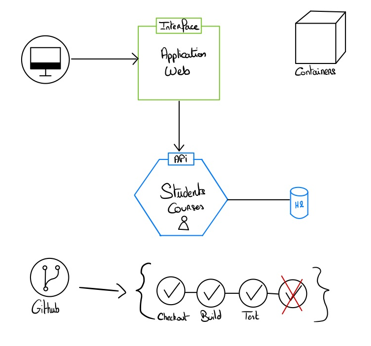
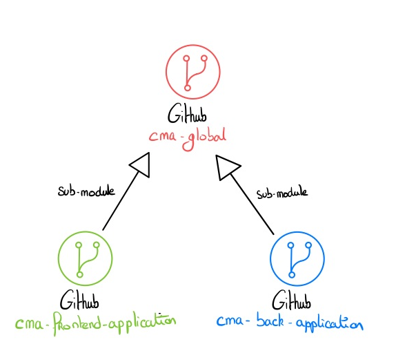

# cma-global project

## Project Description

This project is a university project developed as part of our course on distributed application architecture based on scripts, supervised by SANDU Ionut-Mihai at IDMC as part of the M2 MIAGE SID program.

This is a CRUD-level project that can manage students and courses with a web application that interacts with an API.

## Architecture


Firstly, here is the **architecture** of our project:
  
<div align="center">
  
  
  

</div>

We set up **Docker containers** to be able to launch and configure our service. 
Additionally, we set up a **continuous integration environment** with **GitHub Actions** to test our project with each **merge request**.
  
  
As for our architecture under Github, our main project consists of 2 **submodules** : 
- one for the frontend;
- one for the backend.

<div align="center">

  
</div>

## Technology Stack

We used **Quasar** to design the frontend of our application.</br>
[![Quasar][Quasar]][Quasar-url]

We used the **Java** programming language with the **Spring** framework to design the backend of our application.</br>
[![Java][Java]][Java-url]
[![Spring][Spring.io]][Spring-url]

To manage the documentation of the **API**, we used **Swagger**.</br>
[![Swagger][Swagger]][Swagger-url]

To manage **databases**, we used **h2**.</br>
[![h2][h2]][h2-url]

To manage **continuous integration**, **code quality** (with tests) and **dockerization**, we used **GitHub Actions** and **Docker**</br>
[![GitHub Actions][GitHub Actions]][GitHub Actions-url]
[![Docker][Docker]][Docker-url]

To manage **tests**, we used **JUnit**.</br>
[![JUnit][JUnit]][JUnit-url]

## Getting Started

### Prerequisites
All you need to launch the project is to have Docker.

### Installation

1. **Clone** the repository with its 2 submodules </br>
    (HTTPS)
   ```sh
    git clone --recurse-submodules https://github.com/OliviaWeingartner/cma-global.git
    ```
   **OR**  </br>
    (SSH)
     ```sh
    git clone --recurse-submodules git@github.com:OliviaWeingartner/cma-global.git
    ```
   
2. **Launch** the project
   ```sh
   docker-compose up
   ```

### Usage

The use of the application is done through the application's frontend in a **web browser navigation**.

## Authors

M2 MIAGE SID - IDMC
- Paul KELBERT
- Leo ZANZI
- Jean MATHIEU
- Tom SIGNER
- Benjamin VIGNOT
- Loïc NOSS
- Olivia WEINGARTNER
- Ghost of Ali EL HSSINI (joke)
- Ionut-Mihai SANDU


<!-- MARKDOWN LINKS & IMAGES -->
<!-- https://www.markdownguide.org/basic-syntax/#reference-style-links -->
[Quasar]: https://img.shields.io/badge/Quasar-ED8B00?style=for-the-badge&logo=quasar&logoColor=white
[Quasar-url]: https://quasar.dev/
[Java]: https://img.shields.io/badge/Java-ED8B00?style=for-the-badge&logo=java&logoColor=white
[Java-url]: https://www.java.com/fr/
[Spring.io]: https://img.shields.io/badge/Spring-6DB33F?style=for-the-badge&logo=spring&logoColor=white
[Spring-url]: https://spring.io/
[Swagger]: https://img.shields.io/badge/Swagger-85EA2D?style=for-the-badge&logo=swagger&logoColor=white
[Swagger-url]: https://swagger.io/
[Docker]: https://img.shields.io/badge/Docker-2CA5E0?style=for-the-badge&logo=docker&logoColor=white
[Docker-url]: https://www.docker.com/
[h2]: https://img.shields.io/badge/h2-2CA5E0?style=for-the-badge&logo=h2&logoColor=white
[h2-url]: https://www.h2database.com/html/main.html
[GitHub Actions]: https://img.shields.io/badge/GitHub_Actions-2088FF?style=for-the-badge&logo=github-actions&logoColor=white
[GitHub Actions-url]: https://github.com/features/actions
[JUnit]: https://img.shields.io/badge/JUnit-25A162?style=for-the-badge&logo=junit5&logoColor=white
[JUnit-url]: https://junit.org/junit5/
